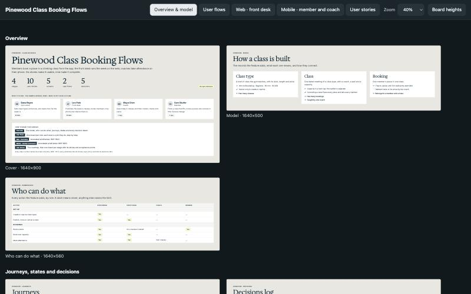
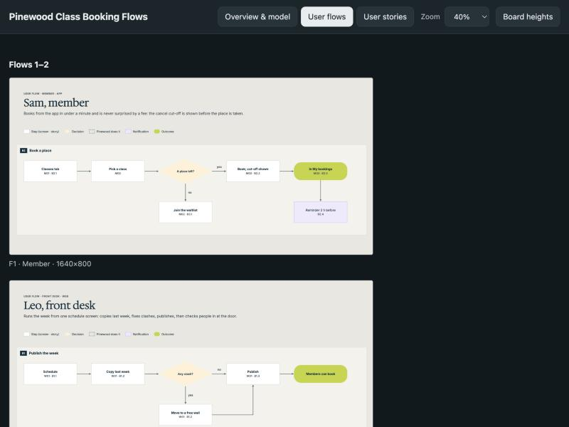
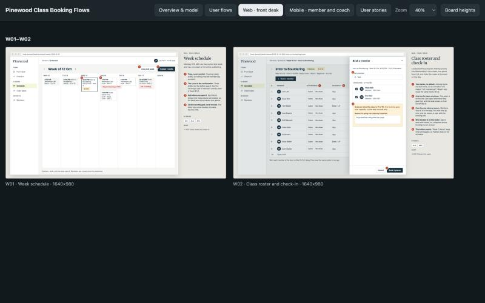
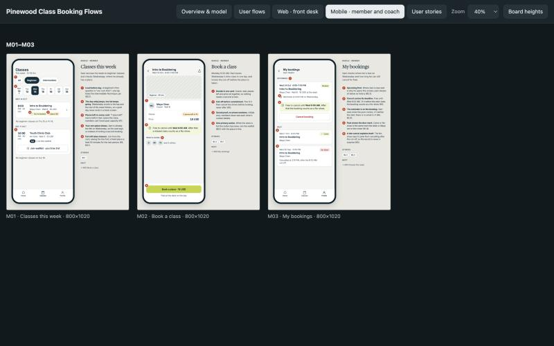
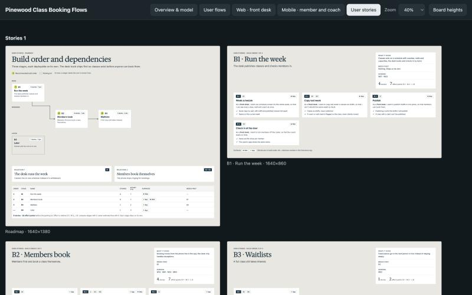

# feature-canvas

A Claude Code skill that turns a feature idea into a **design canvas** before anyone writes code:

- **Overview:** a cover, the model, who can do what, journeys, states, and a numbered decisions log.
- **User flows:** one board per role. Every step names its screen and story.
- **Wireframes:** annotated phone and web screens, with numbered notes explaining each choice.
- **User stories:** a dependency roadmap, then one board per deployable stage, with acceptance points.



Everything except the wireframes is generated from one `spec.py`, so changing a decision means one edit and a rebuild. The output includes a `STORIES.md` backlog ready to build from.

## Install

In Claude Code:

```
/plugin marketplace add nadersafa1/feature-canvas
/plugin install feature-canvas@nadersafa
```

Or from a terminal:

```bash
claude plugin marketplace add nadersafa1/feature-canvas
```

```bash
claude plugin install feature-canvas@nadersafa
```

It needs `python3`; the scripts use only its standard library.

## Use

In any repo, ask for it in plain words, for example "plan the class-booking feature as a canvas", or pick `feature-canvas` from the `/` menu. Claude will:

1. Read the existing product first, if there is one, so the canvas uses its real names and navigation.
2. Interview you one question at a time, and record each answer as a numbered decision. "You decide" becomes an assumed decision, with its reason, for you to confirm later.
3. Write a **sample world**: named people, a fixed "now", and real-looking records, so every board shows the same consistent data.
4. Write `spec.py`, then check it: every story is on a screen, and every reference resolves.
5. Render the generated boards, then draw the wireframes, in parallel when subagents are available.
6. Measure and fit the board heights, then publish:
   - as a **Design canvas** artifact where your Claude account has one;
   - otherwise as a single static `bundle.html` that opens in any browser.

| User flows | Web wireframes |
|---|---|
|  |  |
| **Phone wireframes** | **User stories** |
|  |  |

There's a complete worked example, Pinewood Climbing's class booking:
- its input is in [`skills/feature-canvas/assets/example/`](skills/feature-canvas/assets/example);
- its output is in [`docs/example/`](docs/example): download `bundle.html` and open it.

## Your brand

Set `BRAND` in the spec to use your colours and Google Fonts:

```python
BRAND = {"ink": "#1B1F3B", "accent": "#FFB627", "feature": "#0F7B6C", "serif": "Fraunces", "sans": "Work Sans"}
```

- `ink` is for text and dark fills.
- `accent` is for buttons and outcomes, and must carry ink-coloured text.
- `feature` marks the new feature on existing screens.

## Layout

| Path | What it is |
|---|---|
| `skills/feature-canvas/SKILL.md` | The steps Claude follows |
| `skills/feature-canvas/SPEC.md` | The `spec.py` schema |
| `skills/feature-canvas/WIREFRAMES.md` | The drawing brief, also handed to subagents |
| `skills/feature-canvas/PUBLISH.md` | Publishing routes |
| `skills/feature-canvas/scripts/` | `build.py`, `check.py`, `fit.py`, `board.py`, and the kit |
| `skills/feature-canvas/assets/` | The worked example and the wireframe exemplars |

## License

[MIT](LICENSE) © Nader Safa
